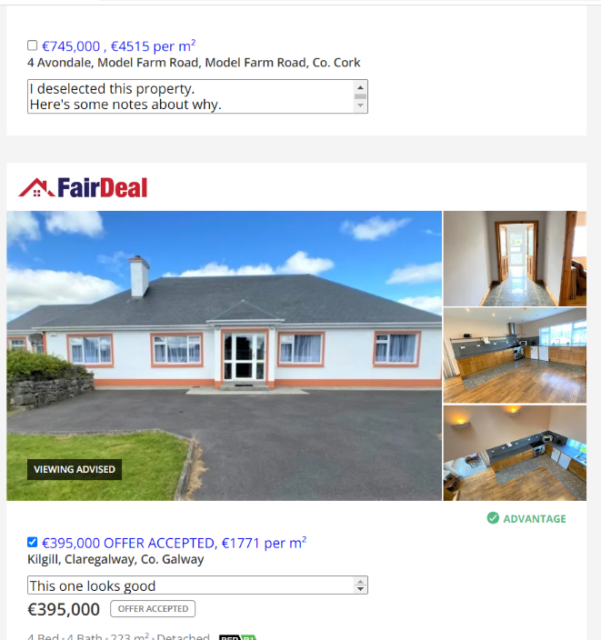
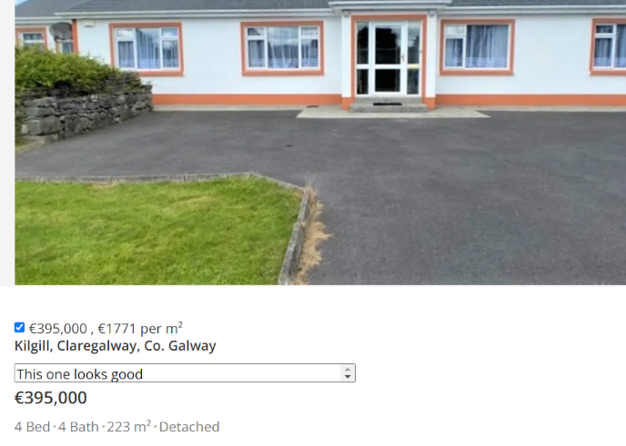

# daft-hide

On daft.ie, "hide" properties, and write notes about them.

To use, copy `index.js` into the Tampermonkey extension for Chrome.

Search page:

Property page:

### Data

The code uses Tampermonkey storage to store a mapping of property URLs to some data stored for each property. To view, edit, or delete the raw data, google "Tampermonkey storage tab".
